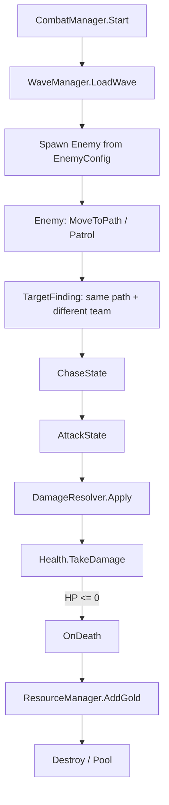
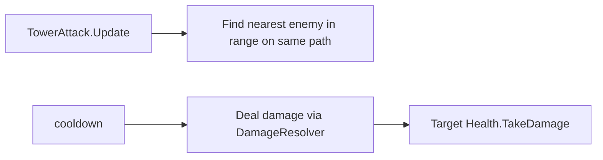

# Combat System Documentation Plan

## 输出文件

- 新建 `[Docs/combat_system_plan.md](Docs/combat_system_plan.md)`。如果 `Docs` 目录不存在，则一并创建。

## 文档结构

1. `战斗系统目标`
  - 概括核心循环：玩家选择灵魂契约，建造/组合作战单元，献祭数影响下一波敌人强度，获得魂晶推动高级单位和增益。
2. `作战单元设计`
  - 用 Markdown 表格整理用户给出的 8 类单元：步兵营、箭塔、炮台、法师塔、哨兵、圣愈厅、狂野乐团、英灵殿。
  - 标出攻击/增益类型、定位、消耗、升级方向。
  - 单独说明“联合单元：攻击单元以组合代替升级”的规则。
3. `资源与升级规则`
  - 区分普通资源与魂晶。
  - 说明普通单位消耗普通资源，高级/特殊功能单位消耗魂晶。
  - 给出升级方向分组：数值强化、射速/范围强化、元素/控制强化、治疗/增益强化、联合单元组合强化。
4. `敌人波次设计`
  - 整理非献祭计数轮：基础轮、精英轮、奖励轮、最终轮。
  - 整理献祭计数轮：恶念强化、作战单元弱化、献祭上限触发特殊敌人。
  - 给出 7 回合波次节奏建议：第 2/4 回合精英，第 6 回合奖励，第 7 回合最终。
5. `敌人设计表`
  - 整理哥布林、死尸、魔狼、巨魔、石巨人、黑骑士、巫妖、毒魔兽。
  - 保留用户给出的倍率血量、移速、单波数量、特殊能力。
  - 补充实现用字段建议，例如 `enemyType`、`rank`、`healthMultiplier`、`moveSpeed`、`spawnCount`、`abilityId`。
6. `系统拆分与 Unity 实现计划`
  - 数据层：`ScriptableObject` 配置单位、敌人、波次、恶念。
  - 运行层：`WaveManager`、`CombatUnit`、`EnemyStats`、`DamageResolver`、`ResourceManager`、`SacrificeTracker`。
  - 表现层：Animator、特效、UI 展示。
  - 与当前项目衔接：复用已有 `Entity`、`StateMachine`、`TargetFinding`、`TargetFollowing`、`Path`。
7. `分阶段开发计划`
  - Phase 1：基础战斗闭环（详见下方「Phase 1 详细计划」）
  - Phase 2：波次规则和魂晶系统。
  - Phase 3：献祭/恶念系统。
  - Phase 4：单位升级与联合单元。
  - Phase 5：特殊敌人与平衡迭代。

---

## Phase 1 详细计划：基础战斗闭环

### 1.1 目标与边界

**目标**：跑通「敌人生成 → 沿路径移动 → 被单位攻击 → 死亡 → 掉落资源」最小闭环，不引入献祭、恶念、魂晶、联合单元。

**本阶段包含**：

- 战斗数据配置（`ScriptableObject`）
- 血量 / 伤害 / 死亡
- 1 种我方攻击单位（箭塔）+ 1 种敌人（哥布林）
- 简化波次生成（固定间隔或固定数量，非 7 回合规则）
- 普通资源掉落与 UI 显示

**本阶段不包含**：

- 灵魂契约、献祭计数、恶念
- 魂晶、治疗、增益、减益、溅射、元素持续伤害
- 8 种单位全量实现
- 联合单元组合升级

### 1.2 目录结构（Phase 1 新增）

```text
Assets/Scripts/Combat/
├── Data/
│   ├── CombatUnitConfig.cs      # SO：单位静态配置
│   ├── EnemyConfig.cs           # SO：敌人静态配置
│   └── WaveConfig.cs            # SO：单波敌人列表（Phase1 简化版）
├── Runtime/
│   ├── Team.cs                  # 阵营枚举
│   ├── TeamMember.cs            # 挂在实体上的阵营标记
│   ├── CombatStats.cs           # 运行时属性（从 Config 初始化）
│   ├── Health.cs                # 受伤、治疗、死亡事件
│   ├── DamageInfo.cs            # 伤害数据结构（类型、数值、来源）
│   ├── DamageResolver.cs        # 静态伤害计算（Phase1 仅物理单体）
│   ├── CombatUnit.cs            # 我方作战单元基类
│   ├── TowerAttack.cs           # 箭塔：射程内选目标 + 按攻速开火
│   ├── Projectile.cs            # 箭矢弹体（可选，也可 Phase1 直接射线伤害）
│   └── EnemyCombat.cs           # 敌人战斗组件，挂到现有 Enemy 上
├── Systems/
│   ├── CombatManager.cs         # 战斗场景总协调
│   ├── WaveManager.cs           # 读 WaveConfig 生成敌人
│   └── ResourceManager.cs       # 普通资源增减 + 事件
└── Presentation/
    ├── HealthBar.cs             # 血条（可先 Debug 文本）
    └── ResourceUI.cs            # 资源显示
```

**复用现有代码（不推翻重写）**：

- `[Entity](Assets/Scripts/Entity/Entity.cs)` + `[StateMachine](Assets/Scripts/StateMachine/StateMachine.cs)`：敌人移动与追击
- `[TargetFinding](Assets/Scripts/BaseComp/TargetFinding.cs)`：扩展为「同路径 + 不同阵营」过滤
- `[Path](Assets/Scripts/Path&Move/Path.cs)` / `[PathRegistry](Assets/Scripts/Path&Move/PathRegistry.cs)`：路径归属
- `[Spawner](Assets/Scripts/GameManager/Spawner.cs)`：Phase1 可保留，但波次生成逐步迁到 `WaveManager`

### 1.3 数据模型（Phase 1）

#### EnemyConfig（ScriptableObject）


| 字段          | 类型         | 示例（哥布林）         |
| ----------- | ---------- | --------------- |
| id          | string     | `goblin`        |
| displayName | string     | 哥布林             |
| maxHealth   | float      | 40（= 0.4 × 100） |
| moveSpeed   | float      | 1.2             |
| rewardGold  | int        | 5               |
| prefab      | GameObject | GoblinPrefab    |


#### CombatUnitConfig（ScriptableObject）


| 字段             | 类型         | 示例（箭塔）           |
| -------------- | ---------- | ---------------- |
| id             | string     | `arrow_tower`    |
| buildCost      | int        | 50               |
| damage         | float      | 15               |
| range          | float      | 5                |
| prefab         | GameObject | ArrowTowerPrefab |


#### WaveConfig（ScriptableObject，简化版）


| 字段            | 类型          | 示例                  |
| ------------- | ----------- | ------------------- |
| waveIndex     | int         | 1                   |
| spawnInterval | float       | 1.5                 |
| entries       | WaveEntry[] | [{goblin, count:6}] |


### 1.4 核心流程




箭塔侧流程：




### 1.5 里程碑与任务拆分

#### M1：战斗基础组件（预计 1–2 天）


| 任务    | 文件                         | 说明                                            |
| ----- | -------------------------- | --------------------------------------------- |
| 阵营系统  | `Team.cs`, `TeamMember.cs` | Ally / Enemy，挂到 Entity 根节点                    |
| 血量组件  | `Health.cs`                | `TakeDamage`, `Heal`, `OnDied` 事件             |
| 伤害结构  | `DamageInfo.cs`            | amount, source, damageType（Phase1 仅 Physical） |
| 伤害结算  | `DamageResolver.cs`        | `Apply(Health target, DamageInfo info)`，暂不做护甲 |
| 运行时属性 | `CombatStats.cs`           | 从 Config 初始化 maxHealth、moveSpeed              |


**验收**：在 Inspector 里手动调用 `TakeDamage`，对象 HP 减少并触发 `OnDied`。

#### M2：配置与敌人接入（预计 1–2 天）


| 任务       | 文件                                              | 说明                                             |
| -------- | ----------------------------------------------- | ---------------------------------------------- |
| 敌人配置 SO  | `EnemyConfig.cs` + `Goblin.asset`               | 哥布林数值                                          |
| 敌人战斗组件   | `EnemyCombat.cs`                                | Awake 时从 Config 初始化 Health、CombatStats         |
| 扩展 Enemy | 修改 `[Enemy.cs](Assets/Scripts/Entity/Enemy.cs)` | 挂 `TeamMember(Enemy)` + `EnemyCombat`，不改状态机主流程 |
| 死亡处理     | `EnemyCombat` 订阅 `Health.OnDied`                | 禁用碰撞、停状态机、通知 WaveManager                       |


**验收**：场景中放 1 个哥布林，Console / 血条可见 HP，手动扣血可死亡。

#### M3：箭塔攻击（预计 2 天）


| 任务               | 文件                                                                             | 说明                                                |
| ---------------- | ------------------------------------------------------------------------------ | ------------------------------------------------- |
| 单位配置 SO          | `CombatUnitConfig.cs` + `ArrowTower.asset`                                     | 箭塔数值                                              |
| 作战单元基类           | `CombatUnit.cs`                                                                | 持有 Config、绑定 Path                                 |
| 箭塔攻击             | `TowerAttack.cs`                                                               | 射程内最近敌人，按 `attackInterval` 造成伤害                   |
| 目标选择             | 扩展 `TargetFinding` 或新建 `CombatTargetQuery`                                     | 过滤：敌方 + 同路径 + 存活 + 射程内                            |
| 攻击接入 AttackState | 修改 `[AttackState](Assets/Scripts/StateMachine/AttackState.cs)` 的 `onAttack` 委托 | Soldier 近战攻击同样走 `DamageResolver`（可选，Phase1 可先只做塔） |


**验收**：箭塔自动攻击同路径哥布林，哥布林 HP 下降并死亡。

#### M4：波次与资源（预计 1–2 天）


| 任务         | 文件                                                              | 说明                                 |
| ---------- | --------------------------------------------------------------- | ---------------------------------- |
| 波次配置       | `WaveConfig.cs` + `Wave01.asset`                                | 6 只哥布林，间隔 1.5s                     |
| 波次管理       | `WaveManager.cs`                                                | 读配置实例化敌人到 spawnPoint               |
| 资源管理       | `ResourceManager.cs`                                            | `AddGold(int)`, `OnGoldChanged` 事件 |
| 战斗协调       | `CombatManager.cs`                                              | 启动 WaveManager，监听敌人死亡加资源           |
| 替换 Spawner | 逐步弃用 `[Spawner.cs](Assets/Scripts/GameManager/Spawner.cs)` 定时逻辑 | Phase1 可并存，最终由 WaveManager 接管      |


**验收**：开战后按波次刷怪，击杀获得金币，UI 数字更新。

#### M5：表现与场景搭建（预计 1 天）


| 任务    | 文件                        | 说明                    |
| ----- | ------------------------- | --------------------- |
| 血条    | `HealthBar.cs`            | 跟随实体，显示 HP 比例         |
| 资源 UI | `ResourceUI.cs`           | 显示当前金币                |
| 测试场景  | `Scenes/CombatTest.unity` | 1 条 Path、1 座箭塔、1 个出生点 |


**验收**：完整跑一局——波次出怪 → 塔击杀 → 资源增加 → 波次结束。

### 1.6 与现有系统的衔接点


| 现有模块                    | Phase 1 改动                                               |
| ----------------------- | -------------------------------------------------------- |
| `TargetFinding`         | `CanDetectTarget` 增加 `TeamMember` 阵营判断；保留 `IsOnSamePath` |
| `AttackState.onAttack`  | Soldier 注入 `() => DamageResolver.Apply(...)`             |
| `Entity.SetCurrentPath` | 箭塔建造时也要 `SetCurrentPath`，否则检测不到敌人                        |
| `Enemy` 状态机             | 不改 Patrol/Chase/Attack 结构，只在外层加 Health                   |
| `Spawner`               | 暂不删，新场景用 `WaveManager`                                   |


### 1.7 Phase 1 验收标准（Definition of Done）

- [ ] 可通过 `WaveConfig` 配置并生成至少 1 波哥布林
- [ ] 哥布林沿 Path 移动，与 Soldier/塔仅在同路径时可被选中
- [ ] 箭塔对范围内敌人造成物理单体伤害
- [ ] 敌人 HP 归零后死亡、不再移动/攻击
- [ ] 击杀掉落普通资源，`ResourceUI` 实时更新
- [ ] 所有战斗数值来自 `ScriptableObject`，无硬编码在 MonoBehaviour
- [ ] 代码目录符合 `Combat/Data`、`Combat/Runtime`、`Combat/Systems` 分层

### 1.8 风险与简化策略


| 风险                     | 应对                                                  |
| ---------------------- | --------------------------------------------------- |
| 箭塔 vs 近战目标选择逻辑重复       | 抽 `CombatTargetQuery` 静态工具类                         |
| Soldier 与 Enemy 攻击节奏不同 | Phase1 塔用 `TowerAttack`，近战仍走 `AttackState.onAttack` |
| 弹体物理复杂                 | Phase1 伤害直接结算，弹体只做视觉（或省略）                           |
| Path 未设置导致无法攻击         | 建造/生成时强制 `SetCurrentPath`，Editor 校验                 |


### 1.9 Phase 1 完成后的自然延伸（→ Phase 2）

- `WaveManager` 接入 7 回合节奏（基础/精英/奖励/最终）
- `ResourceManager` 增加魂晶
- 更多 `EnemyConfig` / `CombatUnitConfig` 资产
- `DamageResolver` 扩展溅射、元素、减益

1. `待确认问题`
  - 是否所有数值都以 `暂定 1 = 100 HP` 为标准换算。
  - 灵魂契约具体选项是否已经定稿。
  - 联合单元组合规则是固定配方还是动态组合。

## 实施方式

- 只创建/编辑 Markdown 文档，不改动游戏代码。
- 文档先作为设计规格和开发路线图，后续可再拆成具体实现任务。

